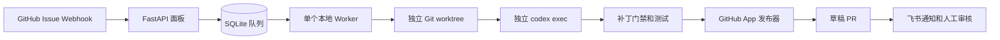

# VikingForge 本地执行设计

## 目标

VikingForge 为 OpenViking 提供“人工接单、Codex 解单、人工合并”的自动化流程。新 Issue 先进入面板，由维护者决定是否消耗 Codex；代码写入和 PR 发布之间存在确定性门禁。

## 架构

服务是一个 Python 进程，包含 FastAPI、SQLite、一个 Worker 线程和可选的飞书通知线程。当前规模只有一个仓库和低频 Issue，不引入 Redis、Celery、PostgreSQL或多 Worker。

## 工作流

1. `issues.opened/reopened` 写入 `awaiting_decision`。
2. 面板“忽略”添加 `agent:ignored`；“继续分析”添加 `agent:analyze`。
3. 只有配置的 GitHub App 机器人添加的 `agent:analyze` 才能创建分诊任务。
4. 分诊任务使用独立 worktree 和临时 Codex 会话，自定义权限配置仅允许读取该 worktree。
5. 分诊结果更新固定 Issue 评论和标签，状态进入 `waiting_approval`。
6. 只有具有 write、maintain 或 admin 权限的人添加 `agent:ready` 才能请求修复。
7. 入队前复核 Issue 修订号、候选结论、信息完整性、风险和排除标签。
8. 修复任务使用新的 worktree 和新的临时 Codex 会话，自定义权限配置仅允许写入该 worktree。
9. 门禁限制最多 5 个文件、500 行，禁止工作流、依赖、认证和安全策略修改；Python 修改必须带回归测试。
10. 验证通过后，服务通过 Git Data API 创建分支和草稿 PR。
11. `pull_request.closed` 更新 `merged` 或 `closed`，合并时写入飞书 Outbox。

## 隔离边界

- Codex 使用部署用户本地 `CODEX_HOME` 登录态，不使用仓库中的 API Key。
- Codex 子进程只继承 PATH、HOME、CODEX_HOME、语言和证书等白名单变量。
- Codex 命令默认拒绝宿主文件系统，仅开放当前 worktree、仓库 Git 元数据、验证虚拟环境和 Codex 临时目录；用户配置、规则、应用、Hook、多 Agent、远程插件和联网能力均关闭。
- 验证进程也使用环境白名单，补丁中的测试代码读不到 GitHub App、Webhook、飞书或面板密钥。
- GitHub App 安装 Token 只存在于发布器 HTTP 请求中，不写入 Git remote、命令行或 worktree。
- 每个运行目录为 `RUNS_DIRECTORY/<run_id>/`，任务结束后移除其中的 worktree，保留结构化结果和截断日志。
- 自动化只创建草稿 PR，不批准、不自动转 Ready、不合并、不绕过分支保护。

## 状态

运行状态只有 `queued`、`running`、`succeeded`、`failed`。

Issue 状态包括 `awaiting_decision`、`ignored`、`triaging`、`waiting_approval`、`claimed`、`coding`、`validating`、`publishing`、`pr_open`、`blocked`、`merged`、`closed`。

进程异常退出后，启动时把遗留 `running` 任务标记为 `failed`，对应 Issue 进入 `blocked`，由维护者确认后重新分诊或重新授权修复，不从发布中间阶段盲目续跑。同一 Issue 最多有一个活动任务。Codex、Git、门禁、测试或发布失败时，错误写入面板和飞书 Outbox。

## 已删除的旧架构

- 不存在 `agent-triage.yml`、`agent-fix.yml`、`agent-reconcile.yml`。
- 不存在 Workflow 回调、回调共享密钥或每小时 Actions 对账。
- 不需要 GitHub Actions Secret、Variable 或 OpenAI API Key。
- 不再用嵌套 Docker 容器运行应用，避免隔离掉宿主用户的 Codex 登录态和仓库。
