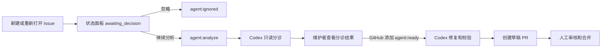

# VikingForge MVP 设计

## 目标

VikingForge 为 `volcengine/OpenViking` 提供一套由维护者把关的 Issue 自动处理流程。新 Issue 不会立即消耗 Codex 资源，而是先进入状态面板，由维护者选择忽略或继续分析。只有选择继续分析后，Codex 才执行只读分诊；只有维护者在 GitHub 添加 `agent:ready` 后，Codex 才能修改代码并创建草稿 PR。

## 核心流程



## 人工决策门禁

- 新建或重新打开的 Issue 仅写入 SQLite 只读模型，初始状态为 `awaiting_decision`。
- 状态面板列表仅提供两个修改操作：`忽略` 和 `继续分析`。
- 两个操作必须使用 HTTP POST、Basic Auth 和 CSRF Token。
- `忽略` 使用短期 GitHub App Token 添加 `agent:ignored`，不调用 Codex。
- `继续分析` 使用短期 GitHub App Token 添加 `agent:analyze`，由标签事件触发只读分诊。
- GitHub 是事实来源。SQLite 不能单独确认决策；GitHub API 写入失败时，页面显示错误并保持 `awaiting_decision`。
- `agent:analyze` 在分诊发布 Job 完成后移除。Issue 内容更新后，维护者可在 GitHub 添加 `agent:retriage` 重新分诊。
- 修复审批仍使用 GitHub 的 `agent:ready`，不进入状态面板。

## 状态面板

状态面板是紧凑的 Issue 列表，不提供独立详情页。每行显示 Issue 编号、标题、作者、更新时间、机器人状态、分诊摘要、工作流和 PR 链接。只有 `awaiting_decision` 行显示“忽略”和“继续分析”按钮；其他状态只展示结果。

状态值为：

`awaiting_decision`、`ignored`、`triaging`、`waiting_approval`、`claimed`、`coding`、`validating`、`publishing`、`pr_open`、`blocked`、`merged`、`closed`。

## 安全边界

- 状态面板服务持有 GitHub App ID 和私钥，但每次操作只签发短期安装 Token。
- 面板服务仅调用 Issue Label API，不执行仓库代码，也不触发任意工作流。
- Codex 分诊 Job 无文件写权限、GitHub 写权限和直接网络权限。
- Codex 修复 Job 无 GitHub 写 Token；发布 Job 仅在确定性校验通过后获得短期 App Token。
- 所有外部 Action 固定到完整提交 SHA。
- 草稿 PR 不能自动批准、自动合并或绕过 `main` 分支保护。

## 目录边界

除 GitHub 强制要求的工作流入口外，全部代码、测试、部署资源和文档归档在：

```text
automation/viking-forge/
├── src/viking_forge/
├── scripts/
├── prompts/
├── schemas/
├── tests/
├── deploy/
├── docs/
├── pyproject.toml
└── README.md
```

GitHub 只能加载仓库根目录下的以下入口：

```text
.github/workflows/agent-triage.yml
.github/workflows/agent-fix.yml
.github/workflows/agent-reconcile.yml
```

这些入口只编排 `automation/viking-forge/` 中的脚本、提示词和 Schema。

## 部署模型

- GitHub-hosted Runner 运行 Codex、补丁门禁和校验。
- 单台 Linux 主机通过 Docker Compose 运行 FastAPI 与 Caddy。
- SQLite Volume 保存状态面板读模型、事件审计和飞书 Outbox。
- GitHub Webhook 写入状态；每小时对账工作流修复漏事件。
- 飞书自定义机器人发送 `pr_open`、`blocked` 和 `merged` 通知。

## MVP 不包含

- 面板内批准修复。
- 自动处理 PR Review 评论。
- 自动批准或合并 PR。
- 多仓库、多租户或细粒度 RBAC。
- Redis、Celery、PostgreSQL 或前端 JavaScript 框架。
