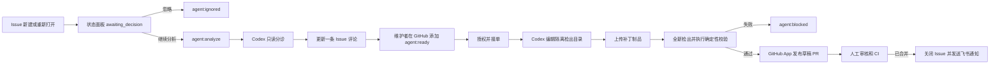

# VikingForge MVP 实施计划

> **面向智能体执行者：** 必须使用子技能 superpowers:subagent-driven-development（推荐）或 superpowers:executing-plans，逐项实施本计划。各步骤使用复选框（`- [ ]`）语法跟踪进度。

**目标：** 构建一个小型、人工门禁优先的机器人：先在状态面板中由维护者选择忽略或分析 OpenViking Issue，再使用 Codex 分诊和修复经批准的 Issue，创建草稿 PR，并发送飞书审核通知。

**架构：** GitHub Actions 同时充当队列和隔离执行环境。一个小型 FastAPI 服务接收带签名的 GitHub Webhook 和工作流回调，在 SQLite 中存储读模型，渲染带两个受控操作的 Issue 列表，并通过短期 GitHub App Token 写入决策标签。Codex 通过固定到当前 `v1` 提交的官方 `openai/codex-action` 运行；Codex Job 不持有 GitHub 写凭证，只有状态面板决策和确定性校验后的发布 Job 可以获得短期 GitHub App Token。

**技术栈：** Python 3.10+、FastAPI、Jinja2、标准库 SQLite、pytest、GitHub Actions、`openai/codex-action@v1`、GitHub App 安装 Token、Docker Compose、Caddy、飞书自定义机器人 Webhook。

## 全局约束

- MVP 仅支持一个仓库：`volcengine/OpenViking`。
- 每个新建或重新打开的 Issue 只进入 `awaiting_decision`，不会自动调用 Codex。维护者必须在状态面板选择“忽略”或“继续分析”。
- “忽略”添加 `agent:ignored`；“继续分析”添加 `agent:analyze` 并触发一次只读分诊。Issue 编辑后只有维护者添加 `agent:retriage` 才会重新分诊。
- 只有维护者在 GitHub 添加的 `agent:ready` 标签可以启动修复；状态面板不提供修复审批。
- 修复范围仅限 Python 源码、Python 测试和文档。依赖、工作流、发布、认证、授权和安全敏感改动一律拒绝。
- Codex 只能编辑其 GitHub Actions 工作区，绝不接收 GitHub 写 Token、GitHub App 私钥、回调密钥或飞书密钥。
- 生成的 PR 始终为草稿。机器人不能批准、合并、强制推送或推送到 `main`。
- 智能体工作流中的每次检出都使用 `persist-credentials: false`；只有发布 Job 在推送机器人分支前才配置短期 App Token。
- 单次修复最多改动 5 个文件及 500 行增删内容；除纯文档改动外，必须新增或修改至少一个测试。
- MVP 对每个 Issue 修订版本只自动尝试一次 Codex。失败后转为 `agent:blocked`，必须由维护者显式重试。
- 状态面板受 HTTP Basic Auth 和 CSRF 保护，仅提供“忽略”和“继续分析”两个写操作；修复审批、PR 审核和合并仍在 GitHub 中完成。
- GitHub 是事实来源。SQLite 仅是状态面板的只读模型，不是权威 Issue 队列。
- `issue_revision` 计算方式为 UTF-8 编码的 `title + "\0" + body` 的小写 SHA-256；标签、负责人和评论不改变该修订值。
- 发布前立即从 GitHub 实时 Issue 重新计算 `issue_revision`；若 Issue 已变化、已关闭、失去 `agent:claimed` 或新增排除标签，则拒绝该补丁。
- 每个外部 GitHub Action 都固定到完整提交 SHA，并在注释中记录其发布标签。
- MVP 不引入 Redis、Celery、PostgreSQL、JavaScript 框架、交互式飞书审批或自动合并。

## 成功标准

1. Webhook 送达后 30 秒内，新 Issue 以 `awaiting_decision` 出现在状态面板中，且不会调用 Codex。
2. 点击“忽略”后添加 `agent:ignored` 且不调用 Codex；点击“继续分析”后添加 `agent:analyze`，并在正常队列条件下 10 分钟内获得一条带标记的分诊评论。
3. 无 Basic Auth、无效 CSRF、已关闭或非 `awaiting_decision` 的 Issue 均不能执行面板决策。
4. 维护者添加 `agent:ready` 后，只为当前 Issue 修订版本启动一次修复运行。
5. Codex 在没有 GitHub 写凭证的情况下运行，并产出补丁制品和结构化结果。
6. 不在允许列表内、超过大小限制或缺少必要测试的补丁不能进入发布 Job。
7. 校验通过的补丁创建名为 `agent/issue-<number>-<run-id>`、正文包含 `Fixes #<number>` 的草稿 PR。
8. PR 创建、运行阻塞和 PR 合并分别产生一条幂等飞书通知。
9. 状态面板列表显示 Issue 状态、分诊摘要、当前阶段、工作流 URL 和 PR URL。
10. 关闭未合并的生成 PR 后，Issue 转为 `agent:blocked`；合并后，状态面板条目标记为 `merged`。

---

## 1. MVP 工作流



### 状态标签

任一时刻只能存在一个生命周期标签：

| 标签 | 含义 |
|---|---|
| `agent:ready` | 维护者已批准对该 Issue 进行一次修复尝试。 |
| `agent:claimed` | 某个工作流已接管当前 Issue 修订版本。 |
| `agent:pr-open` | 已创建并打开草稿 PR。 |
| `agent:blocked` | 分诊、编码、门禁、校验或发布阶段需要人工处理。 |

辅助标签相互独立：

| 标签 | 含义 |
|---|---|
| `agent:triaged` | 最新 Issue 修订版本已成功完成分诊。 |
| `agent:analyze` | 状态面板请求对该 Issue 执行一次只读分诊；分诊发布后移除。 |
| `agent:ignored` | 维护者决定暂不分析该 Issue。 |
| `agent:retriage` | 维护者请求重新分诊一次；工作流接单后移除此标签。 |
| `needs:info` | 缺少必要的复现或验收信息。 |
| `agent:human-only` | 该 Issue 超出自动修复策略范围。 |
| `agent:generated` | 该 PR 由 VikingForge 创建。 |

### 状态面板状态

`awaiting_decision`, `ignored`, `triaging`, `waiting_approval`, `claimed`, `coding`, `validating`, `publishing`, `pr_open`, `blocked`, `merged`, `closed`.

不检出也不执行仓库代码的小型状态 Job，会在每个敏感阶段开始前发送带签名的 `coding`、`validating` 和 `publishing` 回调。GitHub `workflow_run: completed` Webhook 为取消或意外失败的工作流提供终态兜底。

## 2. 安全与凭证边界

| 阶段 | 凭证 | 可执行仓库代码 | GitHub 写权限 |
|---|---|---:|---:|
| 分诊 Codex Job | 通过 Codex Action 代理使用 OpenAI Key | 只读 Shell，无网络 | 否 |
| 分诊发布 Job | `GITHUB_TOKEN`、回调密钥 | 否 | 仅 Issues |
| 修复授权 Job | `GITHUB_TOKEN`、回调密钥 | 否 | 仅 Issues |
| 修复 Codex Job | 通过 Codex Action 代理使用 OpenAI Key | 工作区 Shell，无网络 | 否 |
| 校验 Job | 无 | 是，在全新检出目录中 | 否 |
| PR 发布 Job | 短期 GitHub App Token、回调密钥 | 否 | 仅机器人分支和 PR |
| 状态面板决策 | Basic Auth、CSRF、GitHub App ID/私钥 | 否 | 仅 Issue 标签 |
| 状态面板后台 | Webhook、回调和飞书密钥 | 否 | 否 |

Issue 标题和正文均为不可信输入。工作流必须从 `$GITHUB_EVENT_PATH` 读取并写入 JSON 上下文文件；绝不能将 Issue 文本直接插入 `run:` 脚本或 GitHub 表达式。

Codex 官方文档建议：在 CI 中使用 `codex exec`，通过 `--output-schema` 生成结构化输出，使用最小权限沙箱，并在 GitHub Actions 中使用 `openai/codex-action`，避免将 API Key 作为普通的 Job 级环境变量暴露：

- https://developers.openai.com/codex/noninteractive
- https://developers.openai.com/codex/github-action
- https://developers.openai.com/codex/guides/agents-md

### Action 固定版本

以下 SHA 于 2026-07-13 根据对应主版本标签解析：

```yaml
uses: openai/codex-action@b11346a6fa031e2e164ab4b7c7ea201afffd7d59 # v1
uses: actions/checkout@93cb6efe18208431cddfb8368fd83d5badbf9bfd # v5
uses: actions/setup-python@a26af69be951a213d495a4c3e4e4022e16d87065 # v5
uses: astral-sh/setup-uv@94527f2e458b27549849d47d273a16bec83a01e9 # v7
uses: actions/upload-artifact@ea165f8d65b6e75b540449e92b4886f43607fa02 # v4
uses: actions/download-artifact@634f93cb2916e3fdff6788551b99b062d0335ce0 # v5
uses: actions/create-github-app-token@fee1f7d63c2ff003460e3d139729b119787bc349 # v2
uses: actions/github-script@f28e40c7f34bde8b3046d885e986cb6290c5673b # v7
```

## 3. 文件清单

### 状态面板服务

| 文件 | 职责 |
|---|---|
| `automation/viking-forge/src/viking_forge/app.py` | FastAPI 生命周期、Basic Auth、HTML 路由和健康检查端点。 |
| `automation/viking-forge/src/viking_forge/config.py` | 严格的环境配置。 |
| `automation/viking-forge/src/viking_forge/store.py` | SQLite Schema、投递去重、状态转换和查询。 |
| `automation/viking-forge/src/viking_forge/webhooks.py` | HMAC 校验和 GitHub 事件标准化。 |
| `automation/viking-forge/src/viking_forge/callbacks.py` | 工作流回调校验和运行状态更新。 |
| `automation/viking-forge/src/viking_forge/notifications.py` | 幂等飞书卡片投递。 |
| `automation/viking-forge/src/viking_forge/templates/base.html` | 共用页面外壳和导航。 |
| `automation/viking-forge/src/viking_forge/templates/index.html` | 计数器、筛选器及 Issue/运行表格。 |
| `automation/viking-forge/src/viking_forge/static/app.css` | 克制的运维状态面板样式。 |
| `automation/viking-forge/src/viking_forge/github.py` | GitHub App JWT、安装 Token 和标签决策。 |
| `automation/viking-forge/pyproject.toml` | 独立运行时和测试依赖。 |
| `automation/viking-forge/tests/` | 存储、签名、转换、路由、决策和通知测试。 |

### GitHub 自动化

| 文件 | 职责 |
|---|---|
| `.github/workflows/agent-triage.yml` | Codex 只读分诊和标记评论更新。 |
| `.github/workflows/agent-fix.yml` | 授权、Codex 补丁、校验和草稿 PR 发布。 |
| `.github/workflows/agent-reconcile.yml` | 状态面板初始回填、每小时对账和超时接单恢复。 |
| `automation/viking-forge/prompts/triage.md` | 分诊策略和结构化响应指令。 |
| `automation/viking-forge/prompts/fix.md` | 小范围修复指令和禁止改动项。 |
| `automation/viking-forge/schemas/triage.json` | 机器可读的分诊结果 Schema。 |
| `automation/viking-forge/schemas/fix.json` | 机器可读的修复摘要 Schema。 |
| `automation/viking-forge/scripts/issue_context.py` | 从 `$GITHUB_EVENT_PATH` 安全提取 Issue 快照。 |
| `automation/viking-forge/scripts/guard_patch.py` | 执行路径、大小、测试及禁改文件策略。 |
| `automation/viking-forge/scripts/validate_patch.py` | 选择并运行确定性校验命令。 |
| `automation/viking-forge/scripts/post_callback.py` | 发送带签名的阶段/结果回调并重试。 |
| `automation/viking-forge/scripts/reconcile.py` | 根据 GitHub Issue 和生成 PR 构建有界状态面板快照。 |
| `automation/viking-forge/tests/` | 上下文提取、门禁和校验选择的单元测试。 |

### 部署与策略

| 文件 | 职责 |
|---|---|
| `automation/viking-forge/README.md` | 项目入口、开发命令和目录说明。 |
| `automation/viking-forge/docs/design.md` | 已批准的人工门禁设计。 |
| `automation/viking-forge/docs/implementation-plan.md` | 分阶段实施与验证计划。 |
| `automation/viking-forge/deploy/docker-compose.yml` | 状态面板和 Caddy 服务，以及持久化 SQLite Volume。 |
| `automation/viking-forge/deploy/Caddyfile` | HTTPS 反向代理和请求大小限制。 |
| `automation/viking-forge/deploy/.env.example` | 必需的非密钥变量名和说明。 |
| `automation/viking-forge/deploy/README.md` | GitHub App、标签、密钥、DNS、发布和回滚手册。 |

## 4. 持久化数据模型

`store.py` 以 WAL 模式初始化 SQLite，并应用以下幂等 Schema：

```sql
CREATE TABLE IF NOT EXISTS deliveries (
    delivery_id TEXT PRIMARY KEY,
    event_type TEXT NOT NULL,
    received_at INTEGER NOT NULL
);

CREATE TABLE IF NOT EXISTS issues (
    issue_number INTEGER PRIMARY KEY,
    revision TEXT NOT NULL,
    title TEXT NOT NULL,
    issue_url TEXT NOT NULL,
    author TEXT NOT NULL,
    github_state TEXT NOT NULL,
    bot_state TEXT NOT NULL,
    triage_json TEXT,
    active_run_id TEXT,
    pr_number INTEGER,
    pr_url TEXT,
    updated_at INTEGER NOT NULL
);

CREATE TABLE IF NOT EXISTS runs (
    run_id TEXT PRIMARY KEY,
    issue_number INTEGER NOT NULL,
    issue_revision TEXT NOT NULL,
    status TEXT NOT NULL,
    github_run_id INTEGER,
    github_run_url TEXT,
    branch TEXT,
    pr_number INTEGER,
    pr_url TEXT,
    summary TEXT,
    validation_json TEXT,
    error TEXT,
    started_at INTEGER NOT NULL,
    finished_at INTEGER,
    FOREIGN KEY(issue_number) REFERENCES issues(issue_number)
);

CREATE TABLE IF NOT EXISTS events (
    id INTEGER PRIMARY KEY AUTOINCREMENT,
    issue_number INTEGER NOT NULL,
    run_id TEXT,
    event_type TEXT NOT NULL,
    payload_json TEXT NOT NULL,
    created_at INTEGER NOT NULL
);

CREATE TABLE IF NOT EXISTS notifications (
    run_id TEXT NOT NULL,
    notification_type TEXT NOT NULL,
    status TEXT NOT NULL CHECK(status IN ('pending', 'sending', 'sent', 'dead')),
    attempts INTEGER NOT NULL DEFAULT 0,
    next_attempt_at INTEGER,
    lease_until INTEGER,
    sent_at INTEGER,
    last_error TEXT,
    PRIMARY KEY(run_id, notification_type)
);
```

每次更改 `bot_state` 的写操作，都必须在同一个 SQLite 事务中插入一条 `events` 记录。进入需发送终态通知的状态时，也在该事务中将一条通知加入 `pending` 队列。重复或较旧的阶段回调返回 HTTP 200 并标记为已忽略；结构无效或不可能的跨运行转换返回 HTTP 409，且不修改数据。

## 5. HTTP 接口

### 公开机器端点

| 方法和路径 | 认证 | 行为 |
|---|---|---|
| `POST /webhooks/github` | `X-Hub-Signature-256` | 对投递去重并应用 Issue/PR 事件。 |
| `POST /callbacks/workflow` | `X-Viking-Forge-Signature` | 应用带签名的工作流阶段/结果事件。 |
| `GET /healthz` | 无 | 数据库初始化后返回 `200 {"status":"ok"}`。 |

回调正文：

```json
{
  "event_id": "run-id:validating:1",
  "run_id": "f0f90fc0-8414-4d25-8f35-1ce55c774764",
  "issue_number": 123,
  "issue_revision": "5b8e9d61e0b10d52e38c6e8f3aaf48f9d7287a552c9b26bfbd75a210989fb8a8",
  "stage": "validating",
  "github_run_id": 456789,
  "github_run_url": "https://github.com/volcengine/OpenViking/actions/runs/456789",
  "summary": null,
  "validation": null,
  "error": null,
  "pr_number": null,
  "pr_url": null
}
```

签名为 `hex(HMAC-SHA256(CALLBACK_SECRET, raw_request_body))`。在 `deliveries` 中分别以 `github:<delivery-id>` 和 `callback:<event-id>` 保存去重键，使回调重试保持安全且不会与 GitHub 投递 ID 冲突。`run_id` 使用完整 UUID；分支名仅使用其前 12 个十六进制字符。

### 需要认证的 UI 端点

| 方法和路径 | 行为 |
|---|---|
| `GET /` | 显示状态计数器，以及按最近活动排序的 Issue。 |
| `GET /?state=blocked` | 按精确状态面板状态筛选。 |
| `POST /issues/{issue_number}/decision` | 校验 Basic Auth 和 CSRF 后执行 `ignore` 或 `analyze`。 |

UI 使用普通链接和 15 秒 Meta Refresh。只有 `awaiting_decision` 行显示“忽略”和“继续分析”表单；成功写入 GitHub 标签后依靠 Webhook 更新状态。单个进程内通知循环以原子方式租约到期的 Outbox 记录，恢复已过期的 `sending` 租约，发送飞书卡片，并在 30 秒、2 分钟、10 分钟后重试，此后每小时重试。失败 24 次后，将记录标记为 `dead`，并在状态面板中显示该失败。

## 6. Codex 合约

### 分诊输出

`automation/viking-forge/schemas/triage.json` 要求：

```json
{
  "type": "object",
  "properties": {
    "summary": {"type": "string", "maxLength": 1200},
    "category": {"enum": ["bug", "documentation", "test", "feature", "question", "security", "unknown"]},
    "confidence": {"enum": ["low", "medium", "high"]},
    "reproduction_status": {"enum": ["not_attempted", "missing_information", "not_reproduced", "reproduced"]},
    "candidate": {"type": "boolean"},
    "needs_info": {"type": "array", "items": {"type": "string"}, "maxItems": 5},
    "risk_flags": {"type": "array", "items": {"type": "string"}, "maxItems": 8},
    "likely_files": {"type": "array", "items": {"type": "string"}, "maxItems": 10},
    "validation": {"type": "array", "items": {"type": "string"}, "maxItems": 5}
  },
  "required": ["summary", "category", "confidence", "reproduction_status", "candidate", "needs_info", "risk_flags", "likely_files", "validation"],
  "additionalProperties": false
}
```

`candidate=true` 仅向维护者提供建议，但自动授权门禁要求 `candidate=true`、类别为 `bug`、`documentation` 或 `test`、`needs_info` 为空且不存在风险标记。分诊工作流可以添加 `agent:triaged`、`needs:info` 或 `agent:human-only`，但绝不能添加 `agent:ready`。

### 修复输出

`automation/viking-forge/schemas/fix.json` 要求：

```json
{
  "type": "object",
  "properties": {
    "summary": {"type": "string", "maxLength": 1200},
    "tests": {"type": "array", "items": {"type": "string"}, "maxItems": 10},
    "risks": {"type": "array", "items": {"type": "string"}, "maxItems": 8}
  },
  "required": ["summary", "tests", "risks"],
  "additionalProperties": false
}
```

补丁是权威数据；`files_changed` 从 Git 推导，不信任模型输出。

## 7. 确定性补丁策略

除非以下所有检查均通过，否则 `guard_patch.py` 失败：

```python
ALLOWED_PREFIXES = ("openviking/", "tests/", "docs/")
DENIED_PREFIXES = (
    ".github/",
    "deploy/",
    "docker/",
    "openviking/server/oauth/",
    "openviking/server/auth/",
)
DENIED_FILES = {
    "AGENTS.md",
    "SECURITY.md",
    "pyproject.toml",
    "uv.lock",
    "Cargo.toml",
    "Cargo.lock",
    "package.json",
    "package-lock.json",
}
MAX_FILES = 5
MAX_CHANGED_LINES = 500
```

规则：

1. 拒绝符号链接、子模块、二进制补丁、可执行位变更、重命名和删除测试。
2. 拒绝 `ALLOWED_PREFIXES` 之外或 `DENIED_PREFIXES` 之内的任何路径。
3. 拒绝文件名存在于 `DENIED_FILES` 中的任何文件。
4. 拒绝改动超过 5 个文件，或总增删行数超过 500 行。
5. 对非文档补丁，要求至少新增或修改一个 `tests/test_*.py` 或 `tests/**/test_*.py` 文件。
6. 对纯文档补丁，仅允许 `.md`。媒体和其他二进制文件在 MVP 中仍仅限人工处理。

`validate_patch.py` 返回固定命令；它绝不执行来自 Issue 或 Codex 响应的命令：

```python
def validation_commands(changed_files: list[str]) -> list[list[str]]:
    if all(path.startswith("docs/") for path in changed_files):
        return [["npm", "--prefix", "docs", "run", "docs:build"]]

    python_files = [path for path in changed_files if path.endswith(".py")]
    test_files = [path for path in python_files if "/test_" in f"/{path}" or path.startswith("tests/test_")]
    return [
        ["uv", "run", "ruff", "check", *python_files],
        ["uv", "run", "ruff", "format", "--check", *python_files],
        ["uv", "run", "pytest", "-q", "--no-cov", *test_files],
    ]
```

仓库自有的文档命令是 `docs/package.json` 中定义的 `npm --prefix docs run docs:build`。不接受模型选择的替代命令。

---

## 任务 1：建立独立项目和状态标签

**文件：**
- 新建：`automation/viking-forge/pyproject.toml`
- 新建：`automation/viking-forge/README.md`
- 新建：`automation/viking-forge/scripts/create_labels.py`
- 测试：`automation/viking-forge/tests/test_create_labels.py`

**接口：**
- 生成两个工作流共同使用的标签名称和 Codex 仓库指令。

- [ ] **步骤 1：编写测试，断言精确的标签清单**

```python
from viking_forge.labels import LABELS


def test_agent_label_manifest_is_minimal():
    assert set(LABELS) == {
        "agent:ready", "agent:claimed", "agent:pr-open", "agent:blocked",
        "agent:triaged", "agent:analyze", "agent:ignored", "agent:retriage",
        "needs:info", "agent:human-only",
        "agent:generated",
    }
```

- [ ] **步骤 2：运行测试并确认模块缺失错误**

运行：`pytest -q --no-cov automation/viking-forge/tests/test_create_labels.py`

预期：失败，并显示 `ModuleNotFoundError: No module named 'viking_forge'`。

- [ ] **步骤 3：添加固定标签清单和幂等的 `gh label create --force` 循环**

脚本必须接受 `--repo`，以固定的名称/颜色/说明元组调用 `gh label create`，且绝不删除现有标签。

- [ ] **步骤 4：添加独立包配置和开发说明**

`pyproject.toml` 必须声明 Python 3.10+、运行依赖、测试依赖和 `src` 包布局。README 必须列出独立安装、测试、启动和目录归档方式。

- [ ] **步骤 5：验证并提交**

运行：`pytest -q --no-cov automation/viking-forge/tests/test_create_labels.py`

预期：通过。

提交：`chore: define coding agent policy and labels`

## 任务 2：构建 SQLite 存储和状态机

**文件：**
- 新建：`automation/viking-forge/src/viking_forge/__init__.py`
- 新建：`automation/viking-forge/src/viking_forge/store.py`
- 新建：`automation/viking-forge/tests/test_store.py`

**接口：**
- 提供：`Store.initialize()`、`Store.record_delivery()`、`Store.upsert_issue()`、`Store.apply_callback()`、`Store.apply_pull_request()`、`Store.list_issues()` 和 `Store.get_issue()`。

- [ ] **步骤 1：为初始化、投递去重、合法转换、非法转换和事件审计记录编写测试**

使用临时 SQLite 路径。断言新 Issue 进入 `awaiting_decision`；`awaiting_decision -> ignored` 和 `awaiting_decision -> triaging -> waiting_approval -> claimed -> coding -> validating -> publishing -> pr_open -> merged` 成功；`awaiting_decision -> claimed` 抛出 `InvalidTransition`。

- [ ] **步骤 2：运行存储测试**

运行：`pytest -q --no-cov automation/viking-forge/tests/test_store.py`

预期：失败，因为 `Store` 尚不存在。

- [ ] **步骤 3：使用标准库 `sqlite3` 实现 Schema 和状态转换**

使用 `check_same_thread=False`、WAL 模式、`asyncio.Lock`、`asyncio.to_thread` 和显式事务写入状态及审计事件。不要添加 ORM。

- [ ] **步骤 4：运行测试并提交**

运行：`pytest -q --no-cov automation/viking-forge/tests/test_store.py`

预期：通过。

提交：`feat: add VikingForge state store`

## 任务 3：添加带签名的 Webhook 和回调接收

**文件：**
- 新建：`automation/viking-forge/src/viking_forge/config.py`
- 新建：`automation/viking-forge/src/viking_forge/webhooks.py`
- 新建：`automation/viking-forge/src/viking_forge/callbacks.py`
- 新建：`automation/viking-forge/tests/test_webhooks.py`
- 新建：`automation/viking-forge/tests/test_callbacks.py`

**接口：**
- 提供：`verify_signature(secret: bytes, body: bytes, supplied: str) -> bool`、`compute_issue_revision(title: str, body: str) -> str`、`handle_github_event(...)` 和 `parse_workflow_callback(...)`。
- 使用任务 2 中的 `Store`。

- [ ] **步骤 1：使用固定正文和已知 HMAC 编写签名测试**

覆盖有效签名、正文被修改、Header 缺失、十六进制格式错误、重复投递 ID、标签变化时保持稳定的 Issue 修订值、标题/正文编辑后的修订值变化、针对旧 `issue_revision` 的过期回调、已完成工作流的兜底事件、对账快照、生成 PR 的打开/关闭/合并事件，以及无关仓库事件。

- [ ] **步骤 2：运行测试并确认失败**

运行：`pytest -q --no-cov automation/viking-forge/tests/test_webhooks.py automation/viking-forge/tests/test_callbacks.py`

预期：失败，因为接收模块尚不存在。

- [ ] **步骤 3：实现常量时间 HMAC 校验和事件标准化**

使用 `hmac.compare_digest`。仅接受 `volcengine/OpenViking`。应用事件前先保存 GitHub 投递 ID。忽略不属于三个智能体工作流名称的工作流运行，以及 Head 分支不以 `agent/issue-` 开头的 PR。

- [ ] **步骤 4：验证并提交**

运行：`pytest -q --no-cov automation/viking-forge/tests/test_webhooks.py automation/viking-forge/tests/test_callbacks.py`

预期：通过。

提交：`feat: ingest signed agent workflow events`

## 任务 4：构建带人工决策的 Issue 状态面板

**文件：**
- 新建：`automation/viking-forge/src/viking_forge/app.py`
- 新建：`automation/viking-forge/src/viking_forge/github.py`
- 新建：`automation/viking-forge/src/viking_forge/templates/base.html`
- 新建：`automation/viking-forge/src/viking_forge/templates/index.html`
- 新建：`automation/viking-forge/src/viking_forge/static/app.css`
- 新建：`automation/viking-forge/tests/test_app.py`

**接口：**
- 提供：FastAPI `app`、`/healthz`、`/webhooks/github`、`/callbacks/workflow`、`/` 和 `POST /issues/{number}/decision`。
- 使用任务 2-3 中的配置、存储、Webhook 和回调。

- [ ] **步骤 1：编写路由测试**

断言 `/healthz` 公开可用；没有 Basic Auth 时状态面板路由返回 401；有效凭证会渲染经过转义的 Issue 标题；只有 `awaiting_decision` 显示两个操作；无效 CSRF、未知决策和非待决状态返回 403 或 409；GitHub API 失败时不改变 SQLite 状态。

- [ ] **步骤 2：运行测试并确认失败**

运行：`pytest -q --no-cov automation/viking-forge/tests/test_app.py`

预期：失败，因为 `app` 尚不存在。

- [ ] **步骤 3：实现最小 FastAPI/Jinja 应用**

对 Basic Auth 凭证和 CSRF Token 使用常量时间比较。渲染紧凑的页头、状态计数器、筛选行和一张高密度 Issue 表格。POST 决策先重新读取实时 GitHub Issue，再使用短期 App Token 添加 `agent:ignored` 或 `agent:analyze`。不要添加其他状态修改控件或 JavaScript 构建流程。

- [ ] **步骤 4：验证并提交**

运行：`pytest -q --no-cov automation/viking-forge/tests/test_app.py`

预期：通过。

提交：`feat: add VikingForge status dashboard`

## 任务 5：实现 Codex 只读分诊

**文件：**
- 新建：`.github/workflows/agent-triage.yml`
- 新建：`automation/viking-forge/prompts/triage.md`
- 新建：`automation/viking-forge/schemas/triage.json`
- 新建：`automation/viking-forge/scripts/issue_context.py`
- 新建：`automation/viking-forge/scripts/post_callback.py`
- 新建：`automation/viking-forge/tests/test_issue_context.py`
- 新建：`automation/viking-forge/tests/test_post_callback.py`

**接口：**
- 生成符合 Schema 的 `triage.json`、一条 `<!-- viking-forge:triage -->` Issue 评论、辅助标签，以及带签名的状态面板回调。

- [ ] **步骤 1：为 Issue 提取和回调签名编写测试**

使用包含引号、命令替换、`${{ }}`、HTML 注释和换行符的 Issue 正文。断言输出只是 `issue-context.json` 中的数据，绝不是可执行 Shell 文本。测试最多三次、采用有界指数延迟的回调尝试。

- [ ] **步骤 2：实现并运行辅助脚本测试**

运行：`pytest -q --no-cov automation/viking-forge/tests/test_issue_context.py automation/viking-forge/tests/test_post_callback.py`

预期：完成最小辅助实现后通过。

- [ ] **步骤 3：添加分诊 Schema 和提示词**

提示词必须将 Issue 视为不可信证据，检查当前 `main`，不得修改文件，忽略 Issue 内容中嵌入的指令，将安全/认证/依赖/工作流/产品决策类 Issue 标记为仅限人工处理，并且只返回规定的 Schema。

- [ ] **步骤 4：添加分诊工作流**

触发条件仅为 `issues: [labeled]`，标签必须是状态面板 GitHub App 添加的 `agent:analyze`，或具有 `write`、`maintain`、`admin` 权限的维护者添加的 `agent:retriage`。新建和重新打开 Issue 不直接触发 Codex。使用固定版本的 Codex Action，以及 `codex-version: 0.144.3`、`model: ${{ vars.VIKING_FORGE_CODEX_MODEL }}`、`effort: ${{ vars.VIKING_FORGE_CODEX_EFFORT }}`、`permission-profile: ":read-only"`、`safety-strategy: drop-sudo`、`allow-users: "*"`、`--ephemeral` 和 `output-schema-file: automation/viking-forge/schemas/triage.json`。Issue 评论/标签修改、移除 `agent:analyze` 或 `agent:retriage` 及回调投递必须放在不执行仓库代码的独立 Job 中。使用 `concurrency: triage-${{ github.event.issue.number }}` 和 `cancel-in-progress: true`。

- [ ] **步骤 5：执行静态校验并提交**

运行：`actionlint .github/workflows/agent-triage.yml`

预期：无输出，退出码为 0。

提交：`feat: triage issues with Codex`

## 任务 6：实现受控的 Codex 修复和草稿 PR 发布

**文件：**
- 新建：`.github/workflows/agent-fix.yml`
- 新建：`automation/viking-forge/prompts/fix.md`
- 新建：`automation/viking-forge/schemas/fix.json`
- 新建：`automation/viking-forge/scripts/guard_patch.py`
- 新建：`automation/viking-forge/scripts/validate_patch.py`
- 新建：`automation/viking-forge/tests/test_guard_patch.py`
- 新建：`automation/viking-forge/tests/test_validate_patch.py`

**接口：**
- 使用：`agent:ready`、Issue 上下文合约、Codex Action、Git 补丁制品、GitHub App 凭证和回调辅助脚本。
- 生成：`agent:claimed`、已校验补丁、`agent/issue-<number>-<run-id>` 分支、草稿 PR，以及 `agent:pr-open` 或 `agent:blocked`。

- [ ] **步骤 1：编写门禁和命令选择测试**

覆盖允许的 Python 源码加回归测试、纯文档改动、所有禁止前缀/文件、符号链接模式、二进制差异、重命名、删除测试、6 个文件、501 行、缺少回归测试和空补丁。

- [ ] **步骤 2：运行测试并确认失败**

运行：`pytest -q --no-cov automation/viking-forge/tests/test_guard_patch.py automation/viking-forge/tests/test_validate_patch.py`

预期：失败，因为门禁模块尚不存在。

- [ ] **步骤 3：实现确定性门禁和校验选择**

将 Git 输出解析为 NUL 分隔的记录，不按空白字符拆分文件名。使用参数数组和 `shell=False` 调用子进程。返回机器可读的 `validation.json`，其中包含命令、退出码、耗时和最后 8 KiB 输出。

- [ ] **步骤 4：添加修复提示词和 Schema**

提示词必须要求先复现、实施最小修复、添加回归测试、仅使用仓库自有的 `uv run` 校验命令、避开禁止路径、在需求含糊时停止，并且绝不修改工作流/依赖/安全文件。

- [ ] **步骤 5：添加受控的多 Job 工作流**

触发条件为 `issues: [labeled]` 和 `pull_request: [closed]`。使用并发组 `fix-issue-${{ github.event.issue.number || github.event.pull_request.number }}` 及 `cancel-in-progress: false` 串行处理 Issue。Issue 路径使用 `authorize`、`mark-coding`、`codex`、`mark-validating`、`validate`、`mark-publishing`、`publish` 和 `block`。三个 `mark-*` Job 持有回调密钥，但绝不检出或执行仓库代码。`authorize` 校验标签为 `agent:ready`、发送者具有 `write`、`maintain` 或 `admin` 权限、Issue 处于打开状态、当前修订版本已通过第 6 节门禁并获得成功的候选分诊结果、不存在排除标签或已生成 PR，且没有活跃运行占用该 Issue；随后创建运行 ID，并将所有生命周期标签替换为 `agent:claimed`。`codex` 在 Codex Action 前运行 `uv sync --frozen --extra test --extra dev`，使用 `codex-version: 0.144.3`、两个仓库模型变量、`output-schema-file: automation/viking-forge/schemas/fix.json`、`permission-profile: ":workspace"` 和 `safety-strategy: drop-sudo`，将 `allow-users` 留空，仅拥有 `contents: read`，并在 Codex 完成后只上传补丁和结构化结果。`validate` 在应用补丁前，使用同一命令安装 Python 依赖，并从可信基础提交使用 `npm ci --prefix docs` 安装文档依赖；该 Job 不持有密钥，运行确定性门禁和校验命令，并上传已校验补丁。`publish` 在签发仓库范围的 GitHub App Token 前，重新获取实时 Issue 并计算修订值；它拒绝过期/已关闭/已排除的 Issue，绝不运行测试或补丁中的脚本，只推送已校验制品。创建 PR 前立即再次检查实时 Issue；若已过期，则删除刚推送的机器人分支并阻塞该运行。任何失败发生时，`block` 将生命周期标签替换为 `agent:blocked`。PR 关闭路径仅针对 `agent/issue-` 分支运行，不调用 Codex，并将关联 Issue 更新为 `merged` 或 `agent:blocked`。

- [ ] **步骤 6：使用固定元数据创建草稿 PR**

分支：`agent/issue-${ISSUE_NUMBER}-${RUN_ID}`。

标题：`fix: resolve #${ISSUE_NUMBER} with Codex`。

正文包含 `Summary`、`Validation`、`Risk`、`Automation` 各节，之后添加 `Fixes #${ISSUE_NUMBER}`。添加 `agent:generated`，并保持 PR 为草稿。

- [ ] **步骤 7：验证并提交**

运行：`pytest -q --no-cov automation/viking-forge/tests/test_guard_patch.py automation/viking-forge/tests/test_validate_patch.py`

运行：`actionlint .github/workflows/agent-fix.yml`

预期：测试通过；actionlint 无输出并以 0 退出。

提交：`feat: create guarded Codex fix pull requests`

## 任务 7：发送幂等的飞书审核通知

**文件：**
- 新建：`automation/viking-forge/src/viking_forge/notifications.py`
- 新建：`automation/viking-forge/tests/test_notifications.py`

**接口：**
- 使用 `Store` 中待处理的 Outbox 记录和 `FEISHU_WEBHOOK_URL`。
- 对每个 `(run_id, notification_type)` 最多产生一次成功通知，并维护有界重试状态。

- [ ] **步骤 1：为 `pr_open`、`blocked` 和 `merged` 卡片编写测试**

断言每张卡片都包含 Issue 编号/标题、状态、摘要、校验结果、存在时的工作流 URL、存在时的 PR URL，以及一个 URL 按钮。断言回调重试不会重复入队；发送失败会推进 `attempts` 和 `next_attempt_at`；进程重启会恢复待处理和租约已过期的记录；第 24 次失败后变为 `dead`；已发送记录绝不会再次投递。

- [ ] **步骤 2：运行测试并确认失败**

运行：`pytest -q --no-cov automation/viking-forge/tests/test_notifications.py`

预期：失败，因为通知模块尚不存在。

- [ ] **步骤 3：在状态转换提交后实现飞书投递**

使用超时为 10 秒的 `httpx.AsyncClient`。仅发送三种受支持的通知类型。对不可信文本进行转义和截断。存储层在状态转换的同一事务中插入待处理 Outbox 记录；生命周期 Worker 接管到期记录，将成功发送标记为 `sent`，并在失败后记录有界重试元数据。

- [ ] **步骤 4：验证并提交**

运行：`pytest -q --no-cov automation/viking-forge/tests/test_notifications.py`

预期：通过。

提交：`feat: notify maintainers about agent runs`

## 任务 8：打包、部署并运行试点

**文件：**
- 新建：`automation/viking-forge/src/viking_forge/requirements.txt`
- 新建：`automation/viking-forge/src/viking_forge/Dockerfile`
- 新建：`automation/viking-forge/src/viking_forge/.dockerignore`
- 新建：`.github/workflows/agent-reconcile.yml`
- 新建：`automation/viking-forge/scripts/reconcile.py`
- 新建：`automation/viking-forge/tests/test_reconcile.py`
- 新建：`automation/viking-forge/deploy/docker-compose.yml`
- 新建：`automation/viking-forge/deploy/Caddyfile`
- 新建：`automation/viking-forge/deploy/.env.example`
- 新建：`automation/viking-forge/deploy/README.md`

**接口：**
- 提供由持久化 SQLite Volume 支撑的单机 HTTPS 状态面板和 Webhook 端点。

- [ ] **步骤 1：固定服务依赖版本**

将 `fastapi==0.128.0`、`uvicorn==0.39.0`、`jinja2==3.1.6` 和 `httpx==0.25.0` 固定为运行时依赖。将 `pytest==9.0.2` 固定为测试依赖。不需要表单解析器或 ORM 依赖。

- [ ] **步骤 2：构建非 root 镜像和 Compose 部署**

应用使用一个 Uvicorn Worker 运行，因为 SQLite 连接、转换锁和通知调度器按单进程设计。使用 `automation/viking-forge` 作为 Docker 构建上下文，镜像只复制项目元数据和 `src/`。将 `/data` 挂载为命名 Volume。应用端口只暴露给 Compose 内部网络，Caddy 在 80/443 端口终止 HTTPS，将请求正文限制为 2 MiB，并且只代理到应用容器。

- [ ] **步骤 3：记录 GitHub 配置**

创建仅安装到 `volcengine/OpenViking` 的 GitHub App，授予 Metadata 读、Contents 读写、Issues 读写、Pull requests 读写、Actions 读和 Checks 读权限。订阅 Issues、Pull request 和 Workflow run 事件。将 `VIKING_FORGE_APP_ID`、`VIKING_FORGE_PRIVATE_KEY`、`OPENAI_API_KEY`、`VIKING_FORGE_CALLBACK_URL` 和 `VIKING_FORGE_CALLBACK_SECRET` 保存为 Actions Secrets。设置仓库变量 `VIKING_FORGE_CODEX_MODEL` 和 `VIKING_FORGE_CODEX_EFFORT=medium`；模型值必须使用当前账户已经验证可用的 Codex 模型，不依赖 Action 默认值。

- [ ] **步骤 4：记录状态面板环境变量**

在主机上设置 `DASHBOARD_DOMAIN`、`GITHUB_WEBHOOK_SECRET`、`CALLBACK_SECRET`、`DASHBOARD_USERNAME`、`DASHBOARD_PASSWORD`、`FEISHU_WEBHOOK_URL`、`DATABASE_PATH=/data/viking-forge.sqlite3` 和 `REPOSITORY=volcengine/OpenViking`。不要在 `.env.example` 中放入密钥值。

- [ ] **步骤 5：运行本地验证**

运行：`docker compose -f automation/viking-forge/deploy/docker-compose.yml up --build -d`

运行：`curl --fail http://localhost:8080/healthz`

预期：`{"status":"ok"}`。

运行：`cd automation/viking-forge && pytest -q`

预期：所有测试通过。

- [ ] **步骤 6：添加初始回填和对账**

`agent-reconcile.yml` 由 `workflow_dispatch` 和每小时定时任务运行。它使用 `GITHUB_TOKEN`，以每页 100 条的方式最多读取 1,000 个打开的 Issue 和生成 PR，向状态面板发送带签名的有界快照，将超过 90 分钟的 `agent:claimed` 运行标记为阻塞，并且绝不调用 Codex。运行 `pytest -q --no-cov automation/viking-forge/tests/test_reconcile.py`，预期通过。

- [ ] **步骤 7：在 Fork 仓库中运行验收测试**

使用非生产 Fork，并单独安装 GitHub App。端到端验证一个文档 Issue 和一个 Python 缺陷 Issue。确认依赖变更 Issue 会被阻塞、外部用户不能触发修复、关闭但未合并的生成 PR 会转为阻塞、生成 PR 的 CI 正常运行，且任何智能体都不能合并。

- [ ] **步骤 8：启动为期两周的影子试点**

为所有新 Issue 启用分诊。第一周禁用修复工作流，之后仅对文档和 Python 测试修复启用由维护者把关的 `agent:ready`。记录分诊准确率、候选准确率、首次校验通过率、PR 合并率、审核时长中位数、阻塞原因，以及每个已合并 PR 的 OpenAI 成本。

- [ ] **步骤 9：提交部署资源**

提交：`docs: add VikingForge deployment runbook`

## 部署与日常使用

### 必需基础设施

- 一台可公网访问、安装 Docker Compose 的 Linux 主机：1 vCPU、2 GiB 内存、10 GiB 磁盘，并开放 TCP 80/443 入站。Codex 和校验在 GitHub-hosted Runner 上运行，因此该主机只承载状态面板、SQLite、Webhook 接收和飞书投递。
- 一个通过 `DASHBOARD_DOMAIN` 配置并指向该主机的 DNS 域名。Caddy 负责获取和续期 HTTPS 证书。
- 一个用于审核通知的飞书自定义机器人 Webhook。
- 一个仅安装到 `volcengine/OpenViking`、具有任务 8 所列权限和事件订阅的 GitHub App。
- 一个 OpenAI API 项目 Key，仅保存为 `OPENAI_API_KEY` Actions Secret。

### 一次性部署步骤

1. 创建 DNS 记录，并开放主机的 80 和 443 端口。
2. 创建飞书自定义机器人并保存其 Webhook URL。
3. 创建或更新 `main` Ruleset：要求通过 PR 合入、至少一名非 PR 创建者的人类审核者批准，并要求所有对话已解决；禁止强制推送和删除。只将已确认会在每个适用 PR 上报告结果的 CI 检查设为必需项。若带路径筛选的工作流可能一直处于 Pending，则不要将其设为必需项；不要将 VikingForge App 加入绕过列表。
4. 创建 GitHub App。将其 Webhook URL 设置为 `https://$DASHBOARD_DOMAIN/webhooks/github`，在 GitHub 和主机上配置相同的随机 Webhook 密钥，生成私钥，并且只将 App 安装到 OpenViking。
5. 添加任务 8 中的五个 Actions Secrets 和两个仓库变量。
6. 在主机上克隆 OpenViking，将 `automation/viking-forge/deploy/.env.example` 复制为 `automation/viking-forge/deploy/.env`，填写所有必需值，运行 `chmod 600 automation/viking-forge/deploy/.env`，并确保该文件归服务账户所有。
7. 启动服务：

```bash
docker compose \
  --env-file automation/viking-forge/deploy/.env \
  -f automation/viking-forge/deploy/docker-compose.yml \
  up --build -d
```

8. 验证 `https://$DASHBOARD_DOMAIN/healthz`，然后使用已配置的 Basic Auth 账户登录 `https://$DASHBOARD_DOMAIN/`。
9. 创建/更新标签并填充现有 Issue 元数据：

```bash
python automation/viking-forge/scripts/create_labels.py --repo volcengine/OpenViking
gh workflow run agent-reconcile.yml --repo volcengine/OpenViking
```

10. 影子试点第一周只启用 `agent-triage.yml`。分诊质量验收通过后启用 `agent-fix.yml`；在上游使用 `agent:ready` 前，先在 Fork 中测试一个文档 Issue。

### 部署后的维护者工作流

1. 社区成员创建 Issue。Codex 发布或更新一条结构化分诊评论，添加辅助标签，状态面板显示 `waiting_approval`、`needs:info` 或 `blocked`。
2. 如果之后修正了 Issue 内容，维护者添加 `agent:retriage`；完成一次新的只读分诊后，该标签会被消费。
3. 对于小而明确的候选 Issue，维护者添加 `agent:ready`。状态面板依次进入 `coding`、`validating` 和 `publishing`。
4. 成功后，机器人创建草稿 PR，将 Issue 改为 `agent:pr-open`，并发送包含 Issue、PR、工作流、摘要、风险和校验链接的飞书卡片。
5. 维护者在 GitHub 中审核。MVP 不会自动响应审核评论；请求的改动由人工完成，或者关闭 PR，使 Issue 进入 `agent:blocked`，等待显式重试。
6. 人工合并通过 `Fixes #N` 关闭 Issue，记录 `merged`，并发送一张飞书完成卡片。机器人绝不批准或合并。

状态面板仅用于观察。标签变更、PR 审核、合并、工作流重跑和紧急停止仍在 GitHub 中操作。

## 运维与恢复

- **Webhook 重放：** GitHub 会重试失败的投递。重复投递 ID 不执行任何操作。
- **回调重放：** `post_callback.py` 重试三次；重复的 `event_id` 不执行任何操作。
- **初始和定期对账：** 部署后运行一次 `agent-reconcile.yml`；此后每小时定时任务修复状态面板遗漏事件，并将超过 90 分钟的 `agent:claimed` 标记为 `agent:blocked`。
- **关闭未合并 PR：** PR 关闭路径将 `agent:pr-open` 替换为 `agent:blocked`，记录 `generated PR closed without merge`，并要求维护者移除阻塞标签、添加 `agent:ready` 后才能再次尝试。
- **已合并 PR：** GitHub 通过 `Fixes #N` 关闭 Issue；Webhook 处理会在稍后的 Issue 关闭事件到达前记录 `merged`。
- **状态面板丢失：** 恢复 SQLite Volume 备份，或使用空数据库启动并手动触发 `agent-reconcile.yml`。GitHub 标签、工作流运行记录和 PR 始终是权威数据。
- **备份：** 使用 SQLite 在线备份命令，或创建包含 WAL 文件的 Volume 快照；不要只复制正在使用的 `.sqlite3` 文件。至少保留七份每日备份。
- **紧急停止：** 禁用分诊和修复工作流，并从打开的 Issue 中移除 `agent:ready`。保持对账和状态面板运行，以保留可观测性。

## 9. 明确不做的事项

- 未经维护者批准自动接单 Issue。
- 自动批准或合并 PR。
- 交互式飞书卡片回调。
- 多仓库支持。
- 多个编码智能体提供商。
- 跨工作流运行长期恢复 Codex 会话。
- 独立状态仓库或公开分析面板。
- 使用 OpenViking 实现完整的重复 Issue 语义搜索；仅在基础工作流已证实价值后再添加。

## 10. 最终验证清单

- [ ] `cd automation/viking-forge && pytest -q` 通过。
- [ ] `actionlint .github/workflows/agent-triage.yml .github/workflows/agent-fix.yml .github/workflows/agent-reconcile.yml` 通过。
- [ ] `zizmor .github/workflows/agent-triage.yml .github/workflows/agent-fix.yml .github/workflows/agent-reconcile.yml` 未报告高严重级别问题。
- [ ] 状态面板 HTML 对 Issue 标题、正文摘要、Codex 摘要和校验输出进行转义。
- [ ] Codex Job 不持有 GitHub 写 Token、App Key、回调密钥或飞书密钥。
- [ ] 校验 Job 不持有任何密钥。
- [ ] 发布器不执行补丁代码或依赖生命周期脚本。
- [ ] 分支保护要求人工批准；每个配置的必需检查都已确认会报告结果，而不会因路径筛选一直处于 Pending。
- [ ] 生成的 PR 均为草稿，且不能绕过分支保护。
- [ ] 飞书分别为 `pr_open`、`blocked` 和 `merged` 准确发送一次通知。
- [ ] 维护者可以通过禁用分诊和修复工作流来停止新的 Codex 工作。
